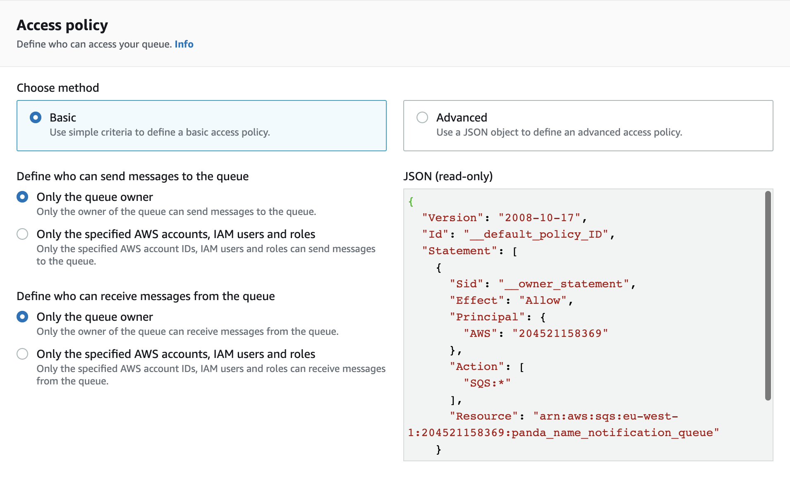

# DevOps Playground September 2020


# Prerequisites

- Modern browser
- An API Client such as [Postman](https://www.postman.com/downloads/) or [Insomnia](https://insomnia.rest/download)

---

## 1. Create a Queue!

On your AWS management console, search for **SQS** using the search bar

Once on the page:

1. Click Create Queue
2. Select **_Standard_**
3. Name your queue `<your_panda_name>_notification_queue`
4. In configuration set receive message wait time to 10
   
5. Disable server-side encryption (we won't be using it for this demo)
6. Set the following access policy for this demo
   
7. Finally click **create queue**

We now have our very own messaging queue! :tada:

---

## 2. Create a lambda function

On a separate tab in your browser navigate to the **lambda** page on the aws console using the search bar

Once on the page:

1. Click create function
2. Name your function `<your_panda_name>_order_status_lambda`
3. Keep the rest of the default configurations
4. Click **create function**

Now lets give our lambda permission to send messages to our queue

5. Navigate to configuration > permissions
6. Click on the Role name under Execution role
7. A new tab will open, click add permission and select attach policy
8. Search for SQS and select `AmazonSQSFullAccess` and click attach policy

## 3. Create an API

Navigate to API Gateway

1. Click **create API**
2. Click build on **HTTP API**
3. Name your API `<your_panda_name>_api`
4. Click add integration
   - Select lambda from the drop down menu
   - Choose the lambda function you created previously
5. Click next
6. Select PUT method and set resource path to `/order_status`
7. Click next and next again and then create finally

You can now see if it works by making a **PUT** request to your invoke url followed by the path `/order_status` using your favourite API client. You should recieve a 200 OK response with "Hello from Lambda!" in the body!

## 4. Make your lambda send messages to SQS!

1. Navigate to the lambda you created in section 2
2. Copy the code in `sendToSQS.js` and paste it in the editor on the AWS console. Lets run through the code!
3. REMEMBER TO ADD YOUR QUEUE URL TO THE PARAMS OBJECT IN THE CODE

```js
QueueUrl: 'QUEUE URL HERE',
```

4. Click deploy
5. Let's test it out by sending a PUT request like we did before with the following in our request body:

```js
{
	"orderId": "1234993",
	"customerEmail": "your@email.com",
	"orderStatus": "DISPATCHED"
}
```

6. Check the response to see if it was successful!
7. You can view the message in the queue by going to your queue and clicking `send and receive messages` and then clicking `Poll for messages`

## 5. Set up SQS poller lambda

Now lets set up a lambda that will consume messages from the queue and do something.

1. Navigate to the lambda home page
2. Select `Use a blueprint`
3. Search for **sqs** in the search box
4. Select `Process messages in an SQS queue` and click configure
5. name your lambda `<your_panda_name>_notification_lambda`
6. Select `Create a new role from AWS policy templates`
7. Name your role `<your_panda_name>_notification_lambda_role`
8. Select your queue and then click create
9. Copy the code in `poller.js` and paste it in the editor on the AWS console.
