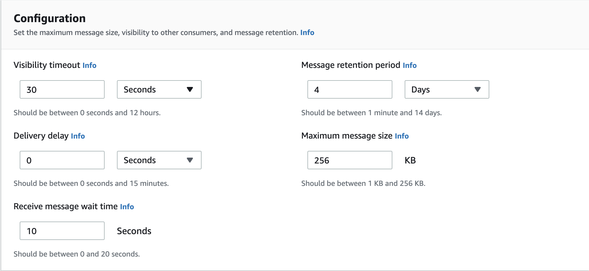
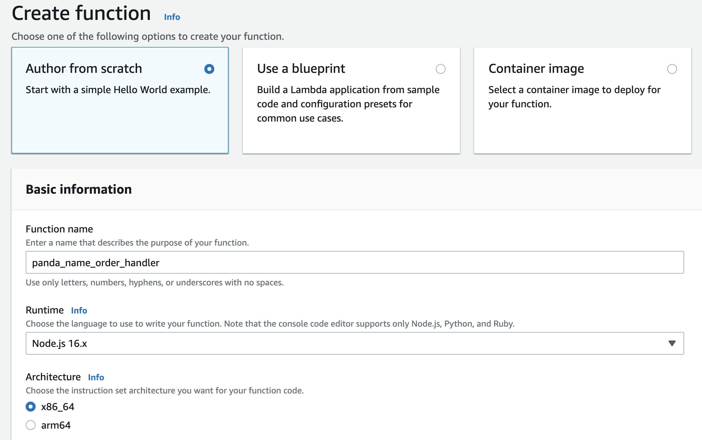
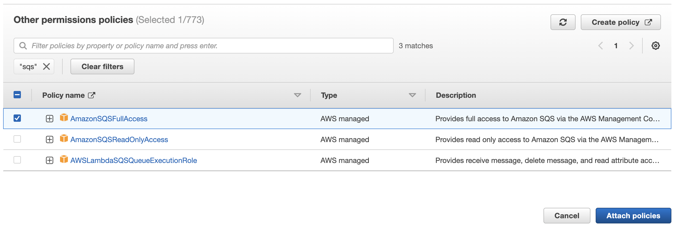
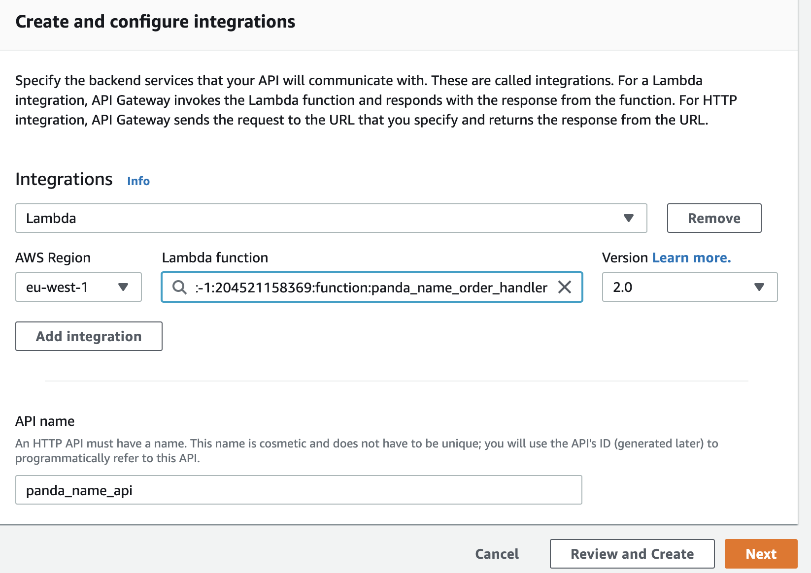
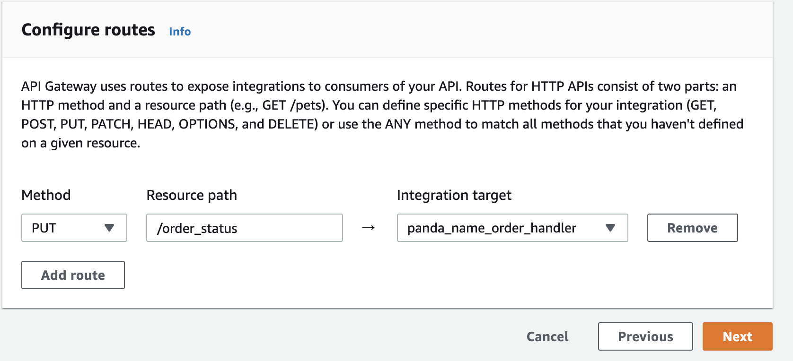
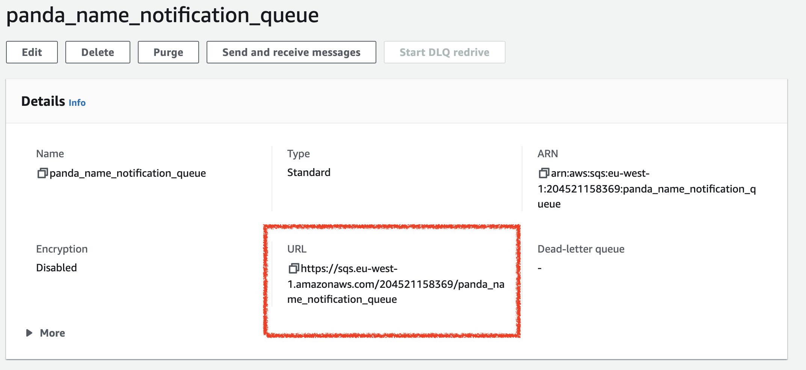
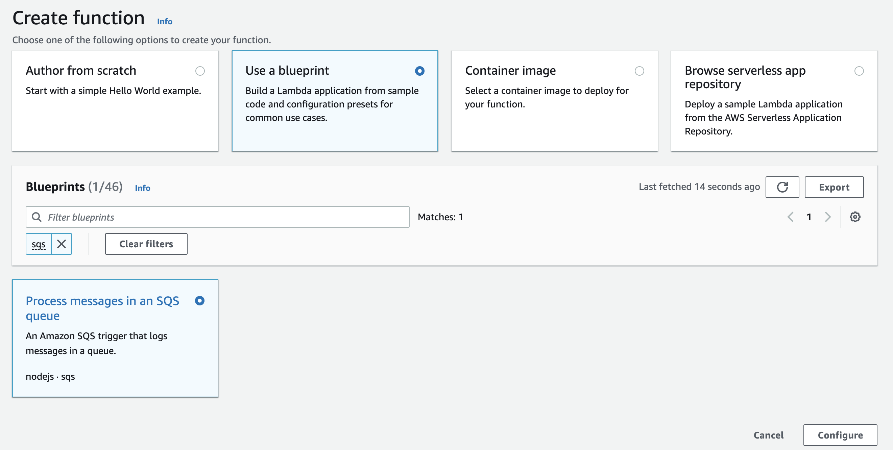
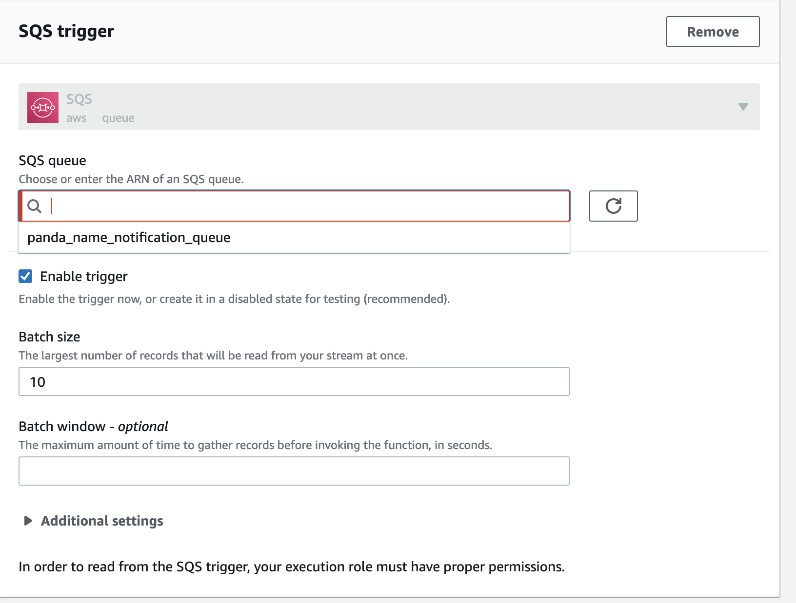

# DevOps Playground September 2022


# Prerequisites

## - Modern browser

## -Optional: An API Client such as [Postman](https://www.postman.com/downloads/) or [Insomnia](https://insomnia.rest/download)

---

## 1. Create a Queue!

On your AWS management console, search for **SQS** using the search bar

Once on the page:

1. Click Create Queue
2. Select **_Standard_**
3. Name your queue `<your_panda_name>_notification_queue`
4. In configuration set receive message wait time to 10
   
5. Disable server-side encryption (we won't be using it for this demo)
6. Set the following access policy for this demo
   
7. Finally click **create queue**

### We now have our very own messaging queue! :tada:

---

## <a name="abcd"></a> 2. Create a lambda function

> Top tip: Duplicate the previous tab on your browser!

Navigate to the **lambda** page on the aws console using the search bar

Once on the page:

1. Click create function
2. Name your function `<your_panda_name>_order_handler_lambda`
3. Select the configuration below
   
   
4. Click **Create function**

### Now lets give our lambda permission to send messages to our queue

5. Navigate to configuration > permissions
6. Click on the Role name under Execution role
   
7. A new tab will open, click add permission and select attach policy
   
8. Search for SQS and select `AmazonSQSFullAccess` and click attach policy
   

> :warning: Note: In the real world you would want to keep the permissions tighter!

---

## 3. Create an API and route

> :bangbang: Ideally we would want a REST API however, for the purposes of this demonstration, lets keep it simple with a HTTP API :bangbang:

1. Navigate to API Gateway
2. Click build on **HTTP API**
   
3. Name your API `<your_panda_name>_api`
4. Click add integration
   - Select lambda from the drop down menu
   - Choose the lambda function you created previously
     
5. Click next
6. Select PUT method and set resource path to `/order_status`
   

7. Click next and next again and then create finally

You can now see if it works by making a **PUT** request to your invoke url followed by the path `/order_status` using your favourite API client. You should receive a `200 OK` response with `"Hello from Lambda!"` in the body!

> You are doing great!

---

## 4. Make your lambda send messages to SQS!

1. Navigate to the lambda you created in [section 2](#abcd)
2. Copy the code in `sendToSQS.js` and paste it in the editor on the AWS console. Lets run through the code!
3. REMEMBER TO ADD YOUR QUEUE URL TO THE PARAMS OBJECT IN THE CODE

> you can get your Queue URL by going to SQS on the console > sqs > queues > click your queue. It should be displayed on the main page.
> 

```js
QueueUrl: 'QUEUE URL HERE',
```

4. Click deploy
5. Let's test it out by sending a PUT request like we did before with the following in our request body:

```js
{
	"orderId": "1234993",
	"customerEmail": "<YOUR EMAIL>",
	"orderStatus": "DISPATCHED"
}
```

6. Check the response to see if it was successful!
7. You can view the message in the queue by going to your queue and clicking `send and receive messages` and then clicking `Poll for messages` at the bottom.

---

## 5. Set up SQS poller lambda

### Now lets set up a lambda that will consume messages from the queue and then send an email to the customer updating them about their order.

1. Navigate to the lambda home page
2. Select `Use a blueprint`
3. Search for **sqs** in the search box
4. Select `Process messages in an SQS queue` and click configure
   
5. Name your lambda `<your_panda_name>_notification_lambda`
6. Select `Create a new role from AWS policy templates`
7. Name your role `<your_panda_name>_notification_lambda_role`
8. For your SQS trigger select your queue
   
9. Click Create
10. Copy the code in `poller.js` and paste it in the editor on the AWS console.

### now lets give our poller permissions to AWS SES (Simple Email Service) so that it can send emails

11. Click the configuration tab and then click on the role
    
12. A new tab will open up. Click add permissions > attach policy
13. search for `sendEmailSES`
14. select the policy and click Attach policies
    

### All Done! :tada: :tada: :tada: :tada:

## 6. Let's take it for a spin!

If you don't have an API client use this curl command to send a request to the API.

> :warning: remember to put in your email and your API invoke URL

```sh
curl -H "Content-Type: application/json" \
  --request PUT \
  --data '{"orderId": "1234993","customerEmail": "<YOUR EMAIL>","orderStatus": "DISPATCHED"}' \
  <INVOKE URL>/order_status
```

If you have Postman or Insomnia send a PUT request to `INVOKE URL/order_status` with following json in the request body:

> :warning: remember to put in your email and your API invoke URL

```js
{
	"orderId": "1234993",
	"customerEmail": "<YOUR EMAIL>",
	"orderStatus": "DISPATCHED"
}
```

### Check your inbox :wink: :sunglasses:
